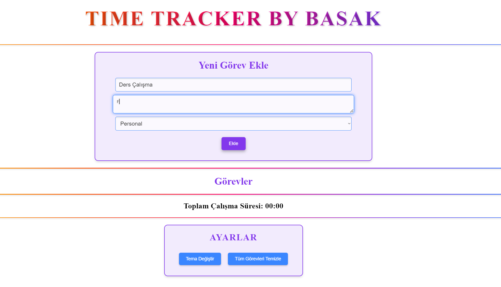
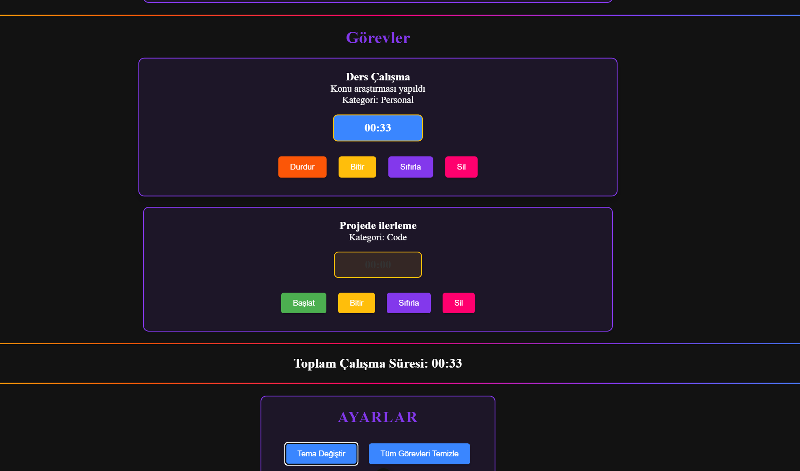

# Time Tracker By Basak

Bu proje, bir görev veya projede harcanan zamanı takip etmeyi kolaylaştırır. Kullanıcı görevler ekleyebilir, bu görevlerin üzerinde çalışmaya başladığında zamanlayıcıyı başlatabilir ve durdurabilir. Uygulama, kullanıcıya toplam çalışma süresini gösterir.

## Proje Özellikleri

- **Görev Ekleme ve Yönetme**: Kullanıcı yeni bir görev ekleyebilir, var olan görevleri başlatabilir, durdurabilir veya silebilir.
- **Zaman Takibi**: Her görev için ayrı ayrı süre tutulur, görev üzerinde çalışmaya başlamak için "Başlat", durdurmak için "Durdur" butonları kullanılır.
- **Tema Seçimi ve Görev Temizleme**: Kullanıcı, koyu ve açık tema arasında geçiş yapabilir. Ayrıca, tüm görevleri temizleme seçeneği de vardır.
- **Toplam Süre Gösterimi**: Eklenen görevlerin toplam süresi bir rapor bölmesinde gösterilir.
- **Tasarım**: Tasarım kısmını çok ciddi alınması için yapmadım tamamen kendi keyif aldığım şekilde rengarenk gereksiz renkler kullandım. Bu proje benim için keyfiydi ve bir tasarım üzerinden ilerlemedim.

## Ekran Görüntüleri




### Gereksinimler

Bu projeyi çalıştırmak için aşağıdaki araçlara ihtiyaç vardır:

- [Node.js](https://nodejs.org/) (14.x veya üstü önerilir)
- [npm](https://www.npmjs.com/) veya [Yarn](https://yarnpkg.com/) paket yöneticisi

### Proje Kurulumu

1. **Depoyu klonlayın**:
   ```bash
   git clone https://github.com/kullanici_adiniz/time_tracker_vue.git
   cd time_tracker_vue
